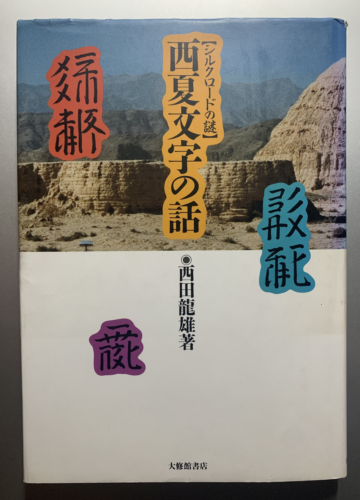

# Learning-Tangut

This is an unofficial translation of the book "The story of Tangut Script (西夏文字の話)" by Tangut linguist Dr. Nishida Tatsuo (西田 龍雄, [wiki](https://en.wikipedia.org/wiki/Tatsuo_Nishida)).

This book was published in 1989, and is still the best introductory book I have read on the Tangut Script (西夏文字). This book has roughly 180 pages. My plan is to finish it within 180 days (by end of 2022).

## Table of Contents

### 第一話　西夏王国的成立和西夏文字
### [第二章 西夏文字的组织概览](chapter2.md)
### 第三章　常用文字的分析和联合关系
#### 一、数詞
#### 二、表示身体部分的文字
#### 三、木冠、鉄冠、石冠的文字
#### 四、表示动物和植物的文字
#### 五、表示色彩的文字
#### 六、杂项
### 第四章　西夏人的格言

<!--### 第一話　西夏王国の成立と西夏文字
### [第二話　西夏文字の組織のあらまし](chapter2.md)
### 第三話　常用文字の分析と連合関係
#### 一、数詞
#### 二、身体部分を表す文字
#### 一、木冠、鉄冠、石冠の文字
#### 一、動物、植物を表す文字
#### 一、色彩を表す文字
#### 一、雑類
### 第四話　西夏人の格言-->

