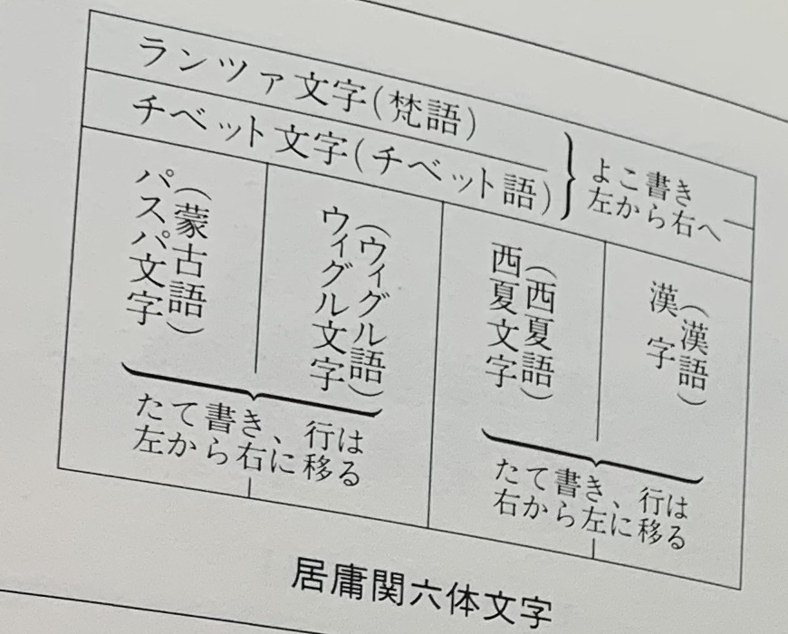

# 第二章 西夏文字的组织概览
<!--第二話　西夏文字の組織のあらまし-->

## 1. 西夏文字的辨识过程
西夏王国的历史现在很大程度上都已经很明晰了。西夏这个国家经常被称作是迷之国度，大概主要是由于占据河西走廊两百多年的西夏王国，被成吉思汗所率领的蒙古军打败后，就突然消失了的缘故。除此之外，传世的西夏文字像极了汉字，但是又是完全未知的死文字，更加诱发了这个国家的魅力。

𗧐𗇘（西夏文字 解脱）

在这里，很有必要跟大家介绍一下这个文字，以及文字背后的语言为人所知的过程。

虽然很早以前人们就知道这种文字的存在，但是并不是最开始人们就知道这是西夏国的文字。1870年法国的蓬拿帕特伯爵（P.R.Bonaparte）就复制公开了居庸关刻文的拓本。居庸关是从北京市出发到达八达岭长城的过街塔，本来是从北京到西域的出发关卡。也是人们祈祷旅途平安的重要佛教遗迹。过街塔如同其名，中间是隧道，内部左右两旁的墙壁上刻着六种文字的文章。既有大号文字，也有小号文字。大字的部分，在东边的墙壁上是尊胜陀罗尼，西边的墙壁上是如来心陀罗尼的梵文音译。小字的部分，自东向西，记录了这座塔建造的由来。根据造塔记载，之前在塔上有大中小的佛塔，现在仅剩塔座。六种文字的书写分上下两段。上段从左往右横着书写的是兰札文（Rañjanā）书写的梵语，藏文书写的藏语。下段又分左右两部分。左边部分，是从左往右竖写的八思巴文字竖写的蒙古语，以及回鹘文字书写的古维吾尔语。右边部分，是从右往左竖写的汉字书写的汉语。在汉字和维吾尔文字中间，还有一种不明文字。当然，它所记载的是哪种语言，之前也是未解之谜。这种不明文字就是西夏文，虽然早些年间被认为是女真文字。居庸关建造年代是1345年，距离西夏国灭亡，已经经过了118年。但是从这块碑文上可以断定，西夏亡国后，西夏的遗民来到当地，而且在当时还是可以读写西夏文的。碑文的西夏文字是漂亮的楷书，并非草书。

<!--此处插入居庸关六体文字的照片-->

> 女真文字
> 金太祖完颜阿骨打命令完颜希尹仿照契丹文字和汉字创制女真文字，1119年公布的是女真大字。20年后，1128年金熙宗完颜亶创制公布了女真小字。除了像汉字一样有单体字以外，还有表音字母。
> 1234年金国灭亡后，东北地区仍然有少数人使用。不过到了15世纪明朝中期，似乎已经完全消亡。明代编纂的《华夷译语》中的《女真馆来文——杂字》部分是重要的资料，此外也有一些传世的碑文。1973年西安文物管理委员会从孝经碑文的石柱里发现了金人手写的《女真字文书》残叶。

> [历史背景链接](http://www.nlc.cn/pcab/gjbhzs/sc/201811/t20181121_173978.htm)

1882年，正确认定这就是西夏文是法国学者戴维理亚(Jean Gabriel Devéria, 1844—1899)。戴维理亚也是公开介绍凉州大云寺西夏文感应塔碑碑文的西夏学者第一人（译者注：其实中国清代学者张澍才是）。感应塔碑的实物现在安放在甘肃武威县文庙中。

到了20世纪，法国的毛利瑟研究了《法华经》。他是在北京获得了金粉在深蓝色纸（所谓“绀纸金泥”）上抄写的《妙法莲花经》，研究了开头的部分，并与1904年发表了研究成果。

> [西夏文泥金写本《妙法莲华经》影印回归 (《光明日报》（ 2018年07月19日 09版）)](https://epaper.gmw.cn/gmrb/html/2018-07/19/nw.D110000gmrb_20180719_1-09.htm)

绀纸金泥的西夏经文数量很少，现存的只有法国吉美博物馆（Musée Guimet）的毛利瑟旧藏4卷，以及中国宁夏出图的法华经贤首品的残卷，以及日本私藏的少量残片。

奇怪的是，西夏文的语法，根据文本的不同，难度有很大的区别。《法华经》中的西夏文属于比较难的，在20世纪初的研究里，有很大一部分没有被解读。

1907年开始的接下来的九年里，俄国地理学协会派科兹洛夫大佐到蒙古和四川探险考察。科兹洛夫率领一队人马从俄罗斯进入蒙古，听到了黑水城（哈拉浩特）有古城遗迹的消息，就开始对黑水城进行挖掘，收获了包括佛像雕刻，佛像画，纸币，以及写有奇怪文字的书籍30多件文物。

> 彼得·库兹米奇·科兹洛夫（Пётр Кузьмич Козлов，1863-1935），出生于斯摩棱斯克，1884年至1888年参加了普尔热瓦尔斯基的探险队，在蒙古西北，西藏北部探险考察。随后数次进行了阿尔泰，青海和四川省的探险发掘。尤其以西夏黑水城的发掘和在以及蒙古国乌兰巴托的诺音乌拉山发现匈奴王侯古墓群而知名。

科兹洛夫在当时自然不了解西夏国的存在以及西夏文字的形态，无法对出土文物做适当的评价，所以把发掘出来的文物寄回了圣彼得堡，自己继续朝着本来的目的地行进。从西宁触发到青海贵德，在贵德的时候接到了圣彼得堡来的新命令，俄国皇家地理学会对这些发掘成果高度评价，判断是西夏的重要文物。科兹洛夫停止了到四川的探险，掉头北上，再次对黑水城进行挖掘。

在为期将近一个月的第二次挖掘中，科兹洛夫的团队全力开动，在破坏佛塔之后，幸运地发现了过去的书房，陆续出土了西夏文的印刷书籍和手抄本。除了2000本以上的书籍，还有300幅佛教画像等西夏重要文物。

黑水城的遗迹中，上层是元代的物品，下层才是西夏时代的遗迹。科兹洛夫在当时应该辨别得很好。

这次科兹洛夫的发掘对后世西夏研究有重大的影响，让灭亡了700余年的西夏国复活，也给解读西夏文字，复原西夏语言提供了难得的机会。

科兹洛夫在黑水城挖掘之后六年，1915年英国的斯坦因也带领第二次中亚探险队来到了黑水城。尽管大部分都是残片，但是斯坦因也带走了大量的西夏文资料。很久以前，我到访大英博物馆的时候，当时在那里的西夏研究专家（Eric D. Grinstead）让我看过一些还未整理的资料。其中有一些和砂土和毛发混杂在一起粘成一团的文字资料，如果仔细把这些分开的话，就会变成小块的残片，让人极其印象深刻。

> 【译者注】Eric D. Grinstead, 著有 “Tangut fragments in the British Museum (1961)", "Analysis of the Tangut Script (1972)"

斯坦因的收集品，基本上是科兹洛夫收集后的剩下的，仔细调查一下，就会发现和科兹洛夫的收集品可以连接上的物品。还有一些情况是，同一部经典被分成了上下两部，看上去并不是自然断裂，而是非常像是近期人为撕裂的痕迹。

> M.A.斯坦因 （1862-1943），生于匈牙利布达佩斯，后获得英国国际。探险家，也是东方历史学者。以三次中亚探索闻名，在新疆和田，新疆民丰（尼雅），敦煌，黑水城各地都有出色的成果。斯坦因因为对东突厥斯坦地区古代文明的研究，尤其是对敦煌文书的收集而闻名。也发表了大量的学术报告。（【译者注】斯坦因在中国的评价因为他掠走大量文物并不高，但不可否认的是，他的学术成果也极其出色。）

斯坦因手机的西夏文资料我基本上都看过，虽然是捡漏剩下的，也有非常珍贵的物品。我一点点给大家介绍。

2. 《番汉合时掌中珠》